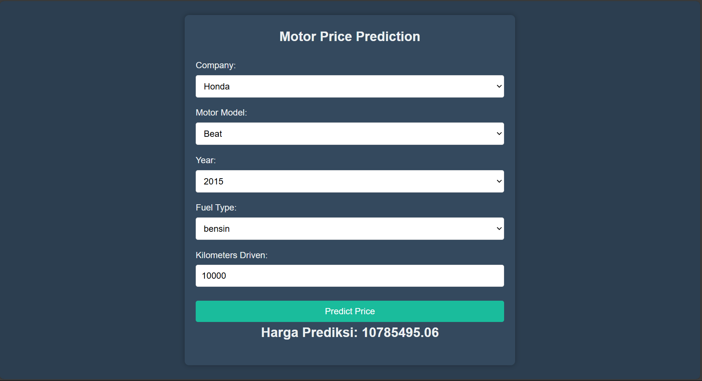

# Motor_Price_Prediction_System
This is an end-to-end Motor Price Prediction System, made using Linear Regression and Flask for the backend and HTML, CSS, and JavaScript for the frontend And MYSQL for Database. The system provides accurate motor price estimates based on user input and historical data. 
## Web Page

## Accuracy:

